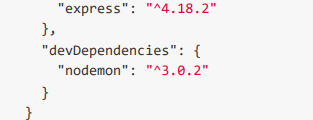

## Step 1

### Express

- C'est une dependance/framework pour la partie backend.
- Pour l'installation => npm install express --save ==> Le "--save" indique que nous aurons besoin d'utiliser cette depedance en production.

### Nodemon

- Permet de démarrer à chaud notre serveur de dev. Chaque CONTROL + S démarre le serveur en prenant en compte les changements realisés.
- Pour le mettre en place, on doit modifier le fichier"PACKAGE.JSON". (Exemple en bas)
  

### CRUD

- C = Create => POST
- R = Read => GET
- U = Update => PUT
- D = Delete => DELETE
